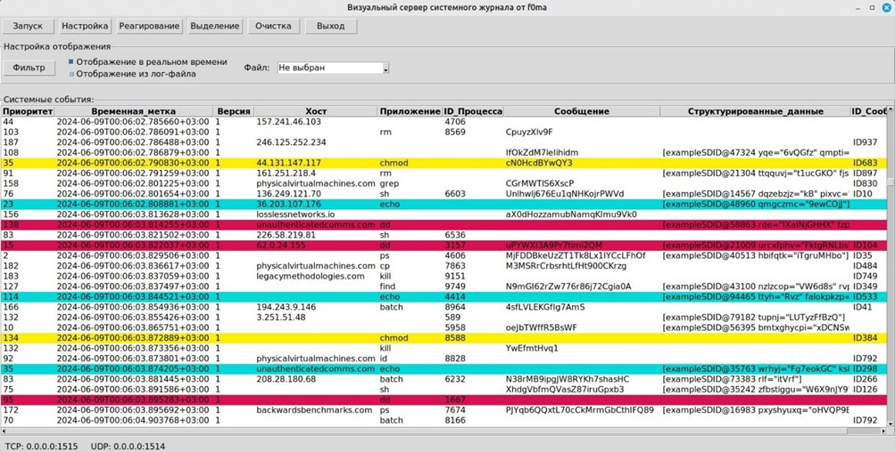
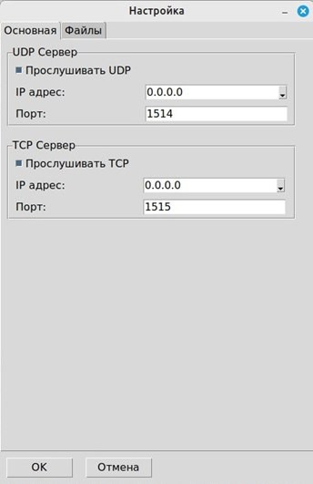
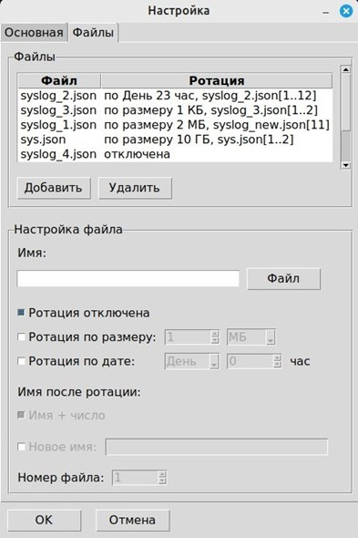
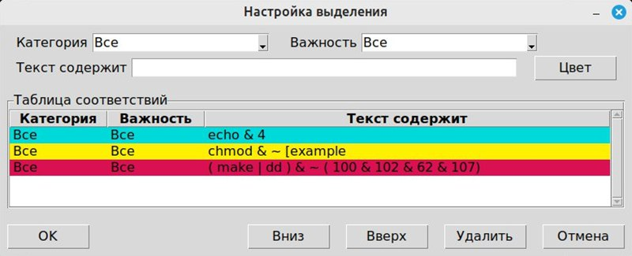
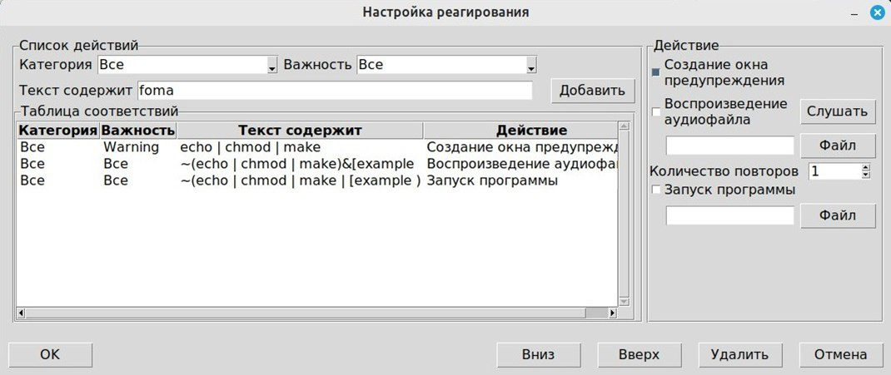
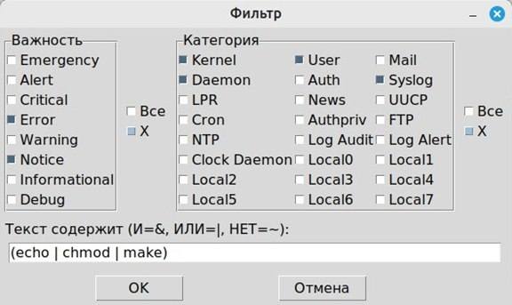

# f0ma

## Описание
Мощное средство для сбора логов с различных устройств, предоставляющие инструменты для эффективного мониторинга и анализа системных событий.

## Установка и запуск

### Windows
1. Скачайте и распакуйте проект.
2. Откройте командную строку и перейдите в папку проекта.
3. Запустите batch скрипт:
    ```cmd
    run_windows.bat
    ```

### Unix/Linux/MacOS
1. Скачайте и распакуйте проект.
2. Откройте терминал и перейдите в папку проекта.
3. Сделайте скрипт исполняемым 
   ```bash
    chmod +x run_unix.sh
   ```
4. Запустите скрипт
   ```bash
    ./run_unix.sh
    ```
## Скриншоты

### Интерфейс "Визуального сервера системного журнала от f0ma"


### Окно настройки соединения


### Окно настройки ротации


### Окно настройки цветового выделения


### Окно настройки реагирования


### Окно настройки фильтрации


